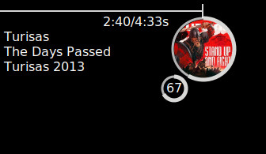

# ClementineConkyTheme
A simple conky widget for Clementine Player.

V1:

V2:

You have to set the path to your conky directory in conkyrc.

The ring can be modifie in conky_draw_config.lua. See the [conky-draw][fisadevLink] documentation for more options. 

## Requirement:
* conkyClementine package

## Thanks
* Fisadev for his script [conky-draw][fisadevLink]

[fisadevLink]: https://github.com/fisadev/conky-draw

##TODO

Add display something when Clementine is not start or find a way to not display the rings
